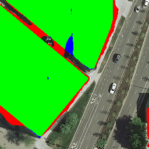
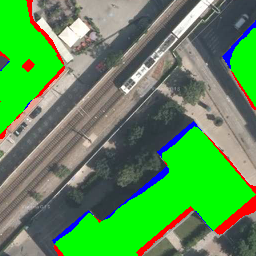
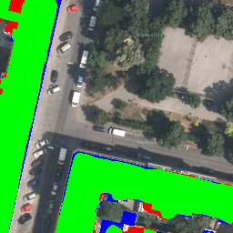
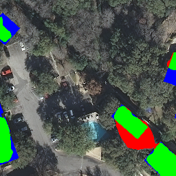
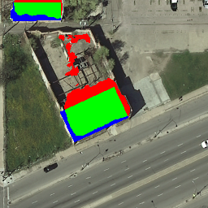
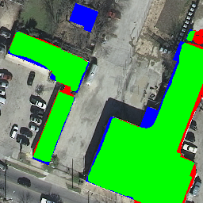
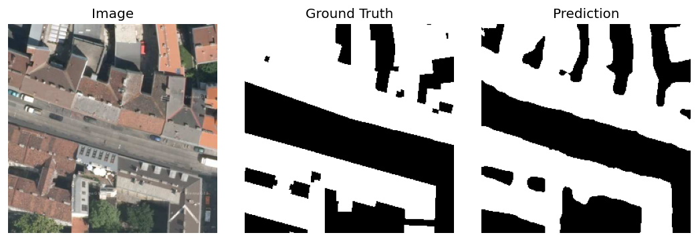
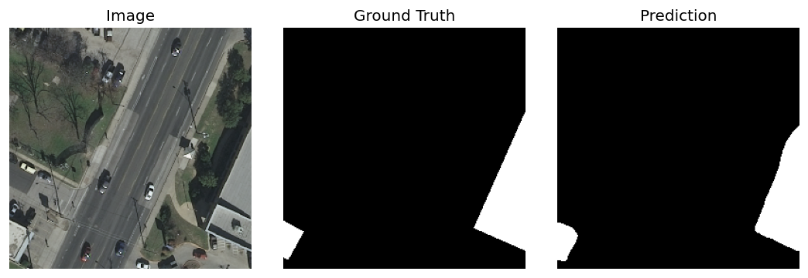

# 🏢 Building Detection with U-Net

Детекция зданий на спутниковых снимках с помощью глубокого обучения.

[](https://github.com/fonof/Building-Detection-with-U-Net)

## 📊 Результаты

| Метрика | Значение |
|---------|----------|
| **Val IoU** | 0.7732 |
| **Val F1** | 0.872 |
| **Датасет** | Inria Aerial (10,000 патчей 256×256) |
| **Модель** | U-Net + ResNet34 (ImageNet) |
| **Время обучения** | ~1 час (50 эпох, GPU) |

## 🎯 Что делает проект

Автоматически находит здания на аэрофотоснимках:

- **Вход:** спутниковое изображение 256×256
- **Выход:** бинарная маска зданий

## 🛠️ Технологии

- **PyTorch** — фреймворк для глубокого обучения
- **Segmentation Models PyTorch** — U-Net архитектура
- **Albumentations** — аугментации данных
- [Inria Aerial Image Labeling Dataset](https://project.inria.fr/aerialimagelabeling/) — высокоразрешённые аэрофотоснимки

## 📦 Установка

```bash
git clone https://github.com/fonof/Building-Detection-with-U-Net.git
cd Building-Detection-with-U-Net

# Веса модели (~93 MB) хранятся в Git LFS
git lfs install
git lfs pull

python -m venv venv
source venv/bin/activate        # Linux / macOS
# venv\Scripts\activate         # Windows (PowerShell / CMD)

pip install torch torchvision torchaudio --index-url https://download.pytorch.org/whl/cu118
pip install -r requirements.txt
```

> **Данные:** скачайте Inria dataset и подготовьте патчи (см. раздел «Подготовка данных»).  
> **Веса модели** уже в репозитории: `models/inria_10k_best.pth` (Val IoU 0.7732, через Git LFS).

## 🚀 Использование

### Подготовка данных

```bash
python src/download_inria.py
python src/prepare_inria.py --source data/Inria_dataset_train --output data/inria_patches
python src/subset_inria.py --source data/inria_patches --output data/inria_subset_10k --num_samples 10000
```

### Обучение модели

```bash
python src/train.py \
  --images_dir data/inria_subset_10k/images \
  --masks_dir data/inria_subset_10k/labels \
  --batch_size 8 \
  --epochs 50 \
  --lr 0.0001 \
  --save_path models/inria_10k_best.pth
```

### Инференс (портфолио)

```bash
python src/final_inference.py \
  --model_path models/inria_10k_best.pth \
  --images_dir data/inria_subset_10k/images \
  --masks_dir data/inria_subset_10k/labels \
  --output_dir output/portfolio \
  --num_samples 10
```

По умолчанию используется **val split 20%** (те же 2000 патчей, что при обучении).

## 📈 Примеры результатов

### Финальный инференс — overlay (TP / FP / FN)


| Цвет | Значение |
|------|----------|
| 🟢 Зелёный | True Positive — здание найдено верно |
| 🔴 Красный | False Positive — ложное срабатывание |
| 🔵 Синий | False Negative — здание пропущено |

<details>
<summary>Отдельные примеры overlay</summary>

| | | |
|:---:|:---:|:---:|
|  |  |  |
|  |  |  |

</details>

### Валидация после обучения (эпоха 50)

| Image | Ground Truth | Prediction |
|:-----:|:------------:|:----------:|
|  | — | — |
|  | — | — |

## 🏗️ Архитектура

```
Input (3×256×256)
    ↓
Encoder: ResNet34 (ImageNet pretrained)
    ↓
Decoder: U-Net + Dropout 0.2
    ↓
Output (1×256×256) → Sigmoid → Binary Mask
```

**Ключевые решения:**

- **BatchNorm frozen in train** — стабильные ImageNet running stats
- **Dice + BCE Loss** — баланс между формой и уверенностью
- **CosineAnnealingLR** — плавное снижение learning rate
- **Inria normalization** — `mean=[0.35, 0.35, 0.35]`, `std=[0.15, 0.15, 0.15]`

## 📊 Метрики обучения

| Эпоха | Val IoU | Val F1 |
|-------|---------|--------|
| 1 | 0.648 | 0.786 |
| 10 | 0.725 | 0.840 |
| 20 | 0.753 | 0.859 |
| 30 | 0.763 | 0.865 |
| 45 | **0.773** | **0.872** |
| 50 | 0.773 | 0.872 |

Лучший чекпоинт сохранён на эпохе 45: `models/inria_10k_best.pth`

## 🗂️ Структура проекта

```
Building-Detection-with-U-Net/
├── src/
│   ├── train.py              # Обучение модели
│   ├── model.py              # Архитектура U-Net
│   ├── dataset.py            # Загрузка данных
│   ├── final_inference.py    # Инференс для портфолио
│   ├── prepare_inria.py        # Нарезка патчей
│   └── download_inria.py     # Скачивание датасета
├── data/                     # Датасет (не в git)
├── models/                   # Веса после обучения
├── output/
│   ├── portfolio/            # Результаты инференса
│   └── val_epoch_050/        # Снимки валидации
└── README.md
```

## 📄 Лицензия

MIT — свободное использование с указанием авторства.
